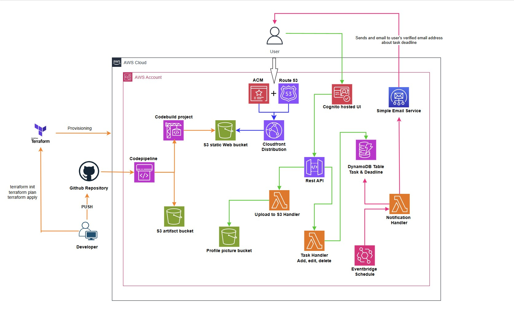

# 📋 Todolist App — AWS Serverless & CI/CD Project

A fully serverless, scalable, and automated Todolist web application built on AWS, provisioned using Terraform, and integrated with CI/CD pipelines via CodePipeline and CodeBuild.

---

## 🖼️ Project Overview

This project demonstrates a real-world, production-grade cloud application with:

- Frontend hosting via **S3 + CloudFront + Route 53**
- Backend APIs using **Lambda + API Gateway**
- Secure user authentication with **Amazon Cognito** hosted UI
- Asynchronous messaging and component decoupling with **Amazon SQS**
- CI/CD using **AWS CodePipeline** and **CodeBuild**
- **Infrastructure as Code** using **Terraform**
- Task deadline notifications powered by **Amazon EventBridge + Lambda + SES**
- Profile upload functionality stored securely in S3
- **HTTPS support via AWS Certificate Manager (ACM)**

---

## 🔧 Tech Stack

| Layer             | Services Used                                                                  |
|-------------------|--------------------------------------------------------------------------------|
| **Frontend**       | HTML, CSS, JS hosted on **S3**, served via **CloudFront** + **Route 53**       |
| **CI/CD**          | **CodePipeline**, **CodeBuild**, GitHub integration, Artifacts stored in S3    |
| **Auth**           | **Amazon Cognito** for user pools, login/signup, and secure access             |
| **Messaging** | **Amazon SQS (Simple Queue Service)** for decoupling API ingestion from backend workers |
| **Backend API**    | **API Gateway** triggering **Lambda** functions                                |
| **Database**       | **Amazon DynamoDB** for task storage, isolated per user                        |
| **Storage**        | S3 bucket for profile pictures, private per user                               |
| **Notifications**  | **Amazon EventBridge** + **Lambda** + **SES** for task deadline reminders      |
| **Infrastructure** | Fully provisioned via **Terraform**                                            |
| **Access Control** | IAM Roles + Inline Policies for all services                                   |
| **SSL/TLS Certs**  | **AWS Certificate Manager (ACM)** for HTTPS on CloudFront and Route 53         |

---

## 🗂️ Architecture Diagram



---

## ✅ Features

- 👤 **User Auth** – Users can sign up, login, verify email and forgot password using Amazon Cognito hosted UI. 
- 📝 **Task Management** – Users can add, update, delete personal tasks  
- ⏰ **Task Deadlines** – Users can set a deadline when adding a task and update it later if needed, enabling flexible task scheduling and time management.

- ⛓️ **Decoupled Architecture (SQS)** – Integrates **Amazon SQS** to handle event-driven message queuing. This decouples API ingestion points from heavy processing backend workers, enhancing application fault-tolerance, eliminating sync blocking bottlenecks, and absorbing rapid bursts in task creation traffic seamlessly.

- 📩 **Email Reminders** – A scheduled Amazon EventBridge rule triggers a Lambda function every 12 hours. The function queries the DynamoDB table for tasks nearing their deadline. If found, it uses Amazon SES (Sandbox mode) to send personalized email reminders to authenticated users whose email addresses have been verified in SES.

📨 Note: AWS SES is currently in sandbox mode, so email notifications are only delivered to verified email addresses.

- 📷 **Profile Uploads** – Users upload profile pictures through a secure, token-validated flow. API Gateway (protected with Cognito authorizer) triggers a Lambda function which verifies the user's identity via JWT claims, decodes the base64 image, and uploads it to a private user-specific path in S3. A presigned URL is then generated for temporary, secure access — ensuring only the authenticated user can view or update their profile picture.

- ♻️ **CI/CD** – GitHub pushes trigger CodePipeline, which uses an S3 artifacts bucket to pass build data between stages. CodePipeline pulls the repo, then CodeBuild filters only the frontend files (HTML, CSS, JS), excluding Terraform and Git metadata. It syncs these files to the target S3 bucket by comparing and deleting outdated files—ensuring the static website always reflects the latest GitHub version.

 
- 🔐 **Access Control** – IAM with least-privilege roles. Iam roles provided temporary credentials to AWS services.  
- 🌐 **HTTPS** – Managed by AWS ACM on CloudFront  
- 🧱 **Infrastructure** – 100% managed and provisioned via Terraform  

---

## 🚀 Deployment

You can deploy this project in your own AWS account:

### Clone the repository for route53 hostedzone

- Note: This project is designed to reference a shared Route 53 Hosted Zone managed in a separate directory. This ensures that even if you run terraform destroy on this application, your shared infrastructure (Domain/DNS) remains unaffected.

git clone https://github.com/patrickneil03/Route53hostedzone.git

```Bash
cd Terraform
```

- Create a terraform.tfvars file inside Terraform folder then replace the parameters with your own.

```hcl
domain_name = "your_registered_domain_name"
aws_region = "your_aws_region"
```

- Apply the changes

```hcl
terraform init
terraform plan
terraform apply
```

### 1. Clone the repo for askflowRepoApp

git clone https://github.com/patrickneil03/TaskflowRepoApp.git


### 2. Configure Terraform

Update your Terraform variable files.


terraform.tfvars (General infrastructure configurations)

**terraform.tfvars**
```hcl
github_owner        = "your_username"
github_repo         = "your_repo"
github_branch       = "main"
sender_email        = "your_email"
route53_domain_name = "your_domain"
custom_domain_name = "your_custom_domain"
custom_cognito_domain = "your_custom_cognito_domain"
```

secrets.auth.tfvars should contain sensitive auth secrets such as:

**secrets.auth.tfvars**
```hcl
facebook_app_id     = "your_facebook_app_id"
facebook_app_secret = "your_facebook_app_secret"
google_client_id    = "your_google_client_id"
google_client_secret = "your_google_client_secret"
codestar_connection_arn ="your_codestarconnection_arn"
```

### 3. Replace the parameters in app.js and profile.js file

In app.js file, replace the line 1, 14,  with your custom domain.
```javascript
const apiUrl = 'https://your_custom_domain/taskhandler';
const TOKEN_EXCHANGE_URL = "https://your_custom_domain/token";
```

In app.js file, replace the line 12, 498, with your domain name.
```javascript
const REDIRECT_URI    = "https://your_domain_name/dashboard.html";
const logoutUri = "https://your_domain_name";
```

In profile.js file, replace the line 119, 216 with your custom domain name
```javascript
const apiUrl = "https://your_custom_domain/profileimagetos3";
const apiUrl = `https://your_custom_domain/profileimagetos3?username=${encodeURIComponent(username)}`;
```

In profile.js file, replace the  line 8 with your aws region and 174 with your domain name.
```javascript
const logoutUri = "https://your_domain_name";
const region         = "your_aws_region;
```


### 4. Create Google & Facebook Identity Providers for Cognito

Follow the instructions in the official AWS documentation to set up your social identity providers:

https://docs.aws.amazon.com/cognito/latest/developerguide/tutorial-create-user-pool-social-idp.html


### 5. Deploy Infrastructure

Go to your code editor and make sure you are in the project's directory inside of Terraform folder.

```hcl
terraform init
terraform validate
terraform plan   # Review planned changes
terraform apply  # Provision infrastructure
```

### 6. Push Frontend Code to GitHub

Run the following commands to push your code. This will trigger **AWS CodePipeline**, which builds and deploys the frontend via **CodeBuild**.

```bash
git add .
git commit -m "Initial deployment"
git push origin main
```

## 🔐 Security  
- **IAM least privilege** – Strict permissions for all roles and services  
- **Cognito token auth** – API access secured via JWT validation  
- **S3 pre-signed URLs** – Profile uploads/fetches use temporary, scoped links (no public S3 access)  
- **HTTPS enforcement** – ACM-managed certificates for all endpoints  
- **Lambda minimal permissions** – Execution roles scoped to required resources only  
- **CloudFront OAC** – S3 bucket accessible *only* via CloudFront (no direct access)  
- **API Gateway throttling** – Rate limiting to prevent abuse (DoS protection)  

## 📚 Learning Highlights
This project helped me develop and demonstrate skills in:

- **AWS Serverless Architecture** – Designing high-availability, cost-optimized systems using fully managed components.
- **Asynchronous Messaging & Decoupling** – Using **Amazon SQS** to implement message queuing, decouple microservices, handle traffic spikes, and create resilient event-driven workflows.
- **Secure CI/CD Pipelines** – Automating full frontend deployment pipelines using GitHub integration, AWS CodePipeline, and AWS CodeBuild.
- **Infrastructure as Code (IaC)** – Writing clean, modular configurations in **Terraform** to enforce 100% automated provisioning and environment repeatability.
- **Event-Driven Automation** – Scheduling cron-based tasks with Amazon EventBridge to poll states and trigger reactive compute layers.
- **Identity & Access Control** – Implementing strict IAM least-privilege permissions and token-validated authentication via Amazon Cognito Hosted UIs.
- **Edge Performance & Static Hosting** – Serving low-latency frontends globally via S3 static website hosting, managed Route 53 DNS routing, and CloudFront CDN caching.
- **Email Automation** – Configuring notification delivery workflows using AWS SES to trigger reliable user alerts.

## 🙋 About Me
I'm an aspiring Cloud Engineer passionate about AWS and DevOps.
This project is part of my hands-on learning journey and cloud portfolio.

[](https://www.linkedin.com/in/patrick-neil-baylen-01b175159)


## Certificate
🧠 AWS Certified Cloud Practitioner
