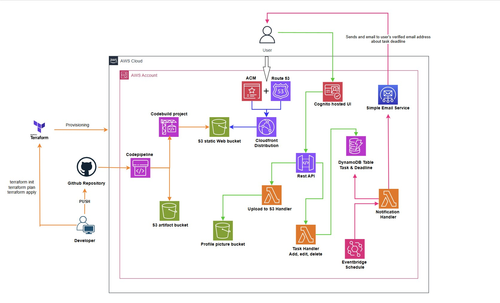

# 📋 Todolist App — AWS Serverless & CI/CD Project

A fully serverless, scalable, and automated Todolist web application built on AWS, provisioned using Terraform, and integrated with CI/CD pipelines via CodePipeline and CodeBuild.

---

## 🖼️ Project Overview

This project demonstrates a real-world, production-grade cloud application with:

- Frontend hosting via **S3 + CloudFront + Route 53**
- Backend APIs using **Lambda + API Gateway**
- Secure user authentication with **Amazon Cognito** hosted UI
- CI/CD using **AWS CodePipeline** and **CodeBuild**
- **Infrastructure as Code** using **Terraform**
- Task deadline notifications powered by **Amazon EventBridge + Lambda + SES**
- Profile upload functionality stored securely in S3
- **HTTPS support via AWS Certificate Manager (ACM)**

---

## 🔧 Tech Stack

| Layer             | Services Used                                                                  |
|-------------------|--------------------------------------------------------------------------------|
| **Frontend**       | HTML, CSS, JS hosted on **S3**, served via **CloudFront** + **Route 53**       |
| **CI/CD**          | **CodePipeline**, **CodeBuild**, GitHub integration, Artifacts stored in S3    |
| **Auth**           | **Amazon Cognito** for user pools, login/signup, and secure access             |
| **Backend API**    | **API Gateway** triggering **Lambda** functions                                |
| **Database**       | **Amazon DynamoDB** for task storage, isolated per user                        |
| **Storage**        | S3 bucket for profile pictures, private per user                               |
| **Notifications**  | **Amazon EventBridge** + **Lambda** + **SES** for task deadline reminders      |
| **Infrastructure** | Fully provisioned via **Terraform**                                            |
| **Access Control** | IAM Roles + Inline Policies for all services                                   |
| **SSL/TLS Certs**  | **AWS Certificate Manager (ACM)** for HTTPS on CloudFront and Route 53         |

---

## 🗂️ Architecture Diagram

---

## ✅ Features

- 👤 **User Auth** – Users can sign up, login, verify email and forgot password using Amazon Cognito hosted UI. 
- 📝 **Task Management** – Users can add, update, delete personal tasks  
- ⏰ **Task Deadlines** – Users can set a deadline when adding a task and update it later if needed, enabling flexible task scheduling and time management.

- 📩 **Email Reminders** – A scheduled Amazon EventBridge rule triggers a Lambda function every 12 hours. The function queries the DynamoDB table for tasks nearing their deadline. If found, it uses Amazon SES (Sandbox mode) to send personalized email reminders to authenticated users whose email addresses have been verified in SES.

- 📷 **Profile Uploads** – Users upload profile pictures through a secure, token-validated flow. API Gateway (protected with Cognito authorizer) triggers a Lambda function which verifies the user's identity via JWT claims, decodes the base64 image, and uploads it to a private user-specific path in S3. A presigned URL is then generated for temporary, secure access — ensuring only the authenticated user can view or update their profile picture.

- ♻️ **CI/CD** – GitHub pushes trigger CodePipeline, which uses an S3 artifacts bucket to pass build data between stages. CodePipeline pulls the repo, then CodeBuild filters only the frontend files (HTML, CSS, JS), excluding Terraform and Git metadata. It syncs these files to the target S3 bucket by comparing and deleting outdated files—ensuring the static website always reflects the latest GitHub version.

 
- 🔐 **Access Control** – IAM with least-privilege roles. Iam roles provided temporary credentials to AWS services.  
- 🌐 **HTTPS** – Managed by AWS ACM on CloudFront  
- 🧱 **Infrastructure** – 100% managed and provisioned via Terraform  

---

## 🚀 Deployment

You can deploy this project in your own AWS account:

### 1. Clone the repo

git clone https://github.com/patrickneil03/TaskflowRepoApp.git

2. Configure Terraform
Update your Terraform variable files such as terraform.tfvars and secrets.auth.tfvars.

terraform.tfvars contains general infrastructure configurations.

secrets.auth.tfvars should contain sensitive auth secrets such as:
facebook_app_id     = "your_facebook_app_id"
facebook_app_secret = "your_facebook_app_secret"
google_client_id    = "your_google_client_id"
google_client_secret = "your_google_client_secret"
codestar_connection_arn ="your_codestarconnection_arn"

3. Create Google & Facebook Identity Providers for Cognito
🔵 Google
Go to Google Cloud Console

Create or select a project.

Go to APIs & Services > Credentials

Create an OAuth 2.0 Client ID

Application type: Web Application

Authorized redirect URI:
https://<your_cognito_domain>/oauth2/idpresponse

Copy the Client ID and Client Secret

Add them to secrets.auth.tfvars

🔵 Facebook
Go to Facebook for Developers

Create an App

Navigate to Facebook Login > Settings

Add the Valid OAuth Redirect URIs:
https://<your_cognito_domain>/oauth2/idpresponse

Go to Settings > Basic to get the App ID and App Secret

Add them to secrets.auth.tfvars

4. Deploy Infrastructure
cd terraform/
terraform init
terraform plan   # Review planned changes
terraform apply  # Provision infrastructure

4. Push Frontend Code to GitHub
git add .
git commit -m "Initial deployment"
git push origin main

This triggers AWS CodePipeline, which builds and deploys the frontend via CodeBuild.

## 🔐 Security  
- **IAM least privilege** – Strict permissions for all roles and services  
- **Cognito token auth** – API access secured via JWT validation  
- **S3 pre-signed URLs** – Profile uploads/fetches use temporary, scoped links (no public S3 access)  
- **HTTPS enforcement** – ACM-managed certificates for all endpoints  
- **Lambda minimal permissions** – Execution roles scoped to required resources only  
- **CloudFront OAC** – S3 bucket accessible *only* via CloudFront (no direct access)  
- **API Gateway throttling** – Rate limiting to prevent abuse (DoS protection)  

## 📚 Learning Highlights
This project helped me develop and demonstrate skills in:

AWS serverless architecture

Secure CI/CD pipelines with GitHub, CodePipeline, and CodeBuild

Infrastructure as Code using Terraform

Event-driven automation with EventBridge

IAM and Cognito for secure access control

Hosting static frontends on S3 with CloudFront and Route 53

Email automation via AWS SES

## 🙋 About Me
I'm an aspiring Cloud Engineer passionate about AWS and DevOps.
This project is part of my hands-on learning journey and cloud portfolio.

## Certificate
🧠 AWS Certified Cloud Practitioner
